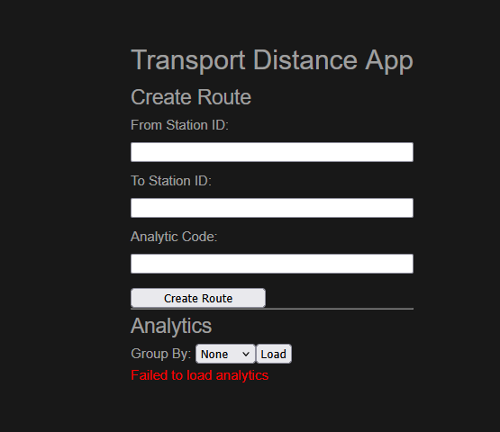

# Etapes de développement

Ce fichier recense les étapes entreprises pour réaliser le défi-technique proposé avec le plus de transparence possible.

## 1. Mise en place de l'environnement
La première étape est d'initialiser et créer l'environnement de travail.

N'étant pas familier avec la création d'environnement Docker et Vue, j'ai d'abord cherché à générer une base avec une IA, afin de comprendre une base que je pouvais travailler selon mes besoins. Cependant, la structure de fichier de base n'a pas été respecté et j'ai ainsi opté pour la documentation en ligne pour créer mon environnement.

Mon IDE de préférence est : Visual Studio Code

J'ai choisis d'adopter la structure de dossier suivante :
Dossier ´frontend´ : où vue.js sera installé
Dossier ´backend´ : où je vais référencer ma création de base de données et y enregistrer mes requêtes importantes

N'ayant aucune idée de si c'est la meilleure structure au long terme, elle va cependant m'aider dans un premier temps à réaliser mon docker-compose, et me permettre de séparer la vue du back.

J'ai ainsi installé vue.js dans le dossier ´frontend´, et testé qu'il fonctionne correctement via les commandes :
´´´
npm create vue@latest
cd ./frontend/
npm install
npm run dev
´´´

Une fois vérifié et accédé, j'ai opté pour la même option, mais via docker, en configurant un docker-compose simple qui comprend le lancement de PostgresDB en plus de l'environnement Vue.js

## 2. Création de la base de données

Le fichier openapi.yml donne une indication très claire de ce qui est attendu de l'API REST, et ainsi de la structure de la base de donnée attendu. 

J'ai ainsi créé un fichier `./db/init.sql` qui permet de créer la base de données suivante :
```
CREATE TABLE stations (
    id SERIAL PRIMARY KEY,
    shortName VARCHAR(5) UNIQUE NOT NULL,
    longName VARCHAR(255) NOT NULL
);

CREATE TABLE distances (
    fk_parent_stations INTEGER NOT NULL,
    fk_child_stations INTEGER NOT NULL,
    distance FLOAT,

    CONSTRAINT fk_parent FOREIGN KEY (fk_parent_stations)
        REFERENCES stations(shortName),

    CONSTRAINT fk_child FOREIGN KEY (fk_child_stations)
        REFERENCES stations(shortName)
);
```

Configuré Docker pour qu'il exécute le script automatiquement lors d'un docker compose up.
Réalisé un test `test_init_db.sh` qui permet de vérifier le bon fonctionnement de la création de la base de données

## 3. Peupler la base de données

Les fichiers stations.json et distances.json donnent toutes les données nécessaires à l'exercice. Etant structurés parfaitement pour être inséré dans une base de données, je converti manuellement avec notepad++ en utilisant le remplacement étendu pour formatter le json en sql.

J'ai ajouté les requêtes d'INSERT dans init_db.sql et testé son bon fonctionnement avec le test réalisé au préalable, ainsi qu'adapté pour les nouvelles données

J'ai également apporté une modification à la struature de la base de données pour ajouter le nom du moyen de transport, qui n'était pas géré auparavent

## 4. Créer une première l'interface fonctionnelle

### 4.1 Chemins HTTPs
Pour l'interface j'ai imaginé tout d'abord une interface fonctionnelle qui permet de réaliser le squelette du site internet, afin de pouvoir vérifier et tester les besoins
Le fichier ´openapi.yml´ indique l'intention de développement des différentes pages. J'en déduis les informations suivantes :
- /routes - Permet la requête d'un trajet entre un point A et B
- /stats/distances - L'affichage du trajet demandé, avec une somme calculée des distances parcourues (en bonus)

### 4.2 les objets Vues.js
J'ai la chance d'avoir un ami pratiquant Vues.js professionnelement qui m'a expliqué en bref la structure du framework : C'est une approche orienté objet de la création de composants web. Avec cette base, j'ai facilement pu déterminer, toujours avec le fichier ´openapi.yml´, quels objets et structure étaiend demandés :
- securitySchemes : Pour accompagner chaque page avec des informations de sécurités : pour l'authentification par exemple
- schemas : toutes les structures des requêtes pour l'API Rest

Ce qui laisse libre choix quand à la structure de l'interface utilisateur, au besoin.

Pour créer la base, l'IA étant super pour cette tâche, je l'ai employé pour générer une interface de base que je pourrais manuellement modifier à ma guise.

Ce qui donne un premier rendu :


Il manque énormément d'éléments, notamment une liste déroulante ou de l'autocompletion sur les champs, ainsi qu'une interface plus belle, mais à nouveau, on cherche le fonctionnel pour tester l'API.

### 4.3 La table d'analytics

Via AnalyticDistance et AnalyticDistanceList, je comprends qu'il y a un besoin de stocker les résultats fournis à l'utilisateur, notamment afin de vérifier son bon fonctionnement, mais également afin de savoir quels trajets sont les plus intéressants et à valoriser dans le logiciel. Cela implique la création d'une nouvelle table dans la base de données :
´´´
CREATE TABLE routes (
    id UUID PRIMARY KEY DEFAULT gen_random_uuid(),
    from_station_id VARCHAR(5) NOT NULL REFERENCES stations(shortName),
    to_station_id VARCHAR(5) NOT NULL REFERENCES stations(shortName),
    analytic_code VARCHAR(255) NOT NULL,
    distance_km FLOAT NOT NULL,
    path TEXT[] NOT NULL,
    created_at TIMESTAMPTZ NOT NULL DEFAULT NOW()
);
´´´

Et ajouté cette table dans le test